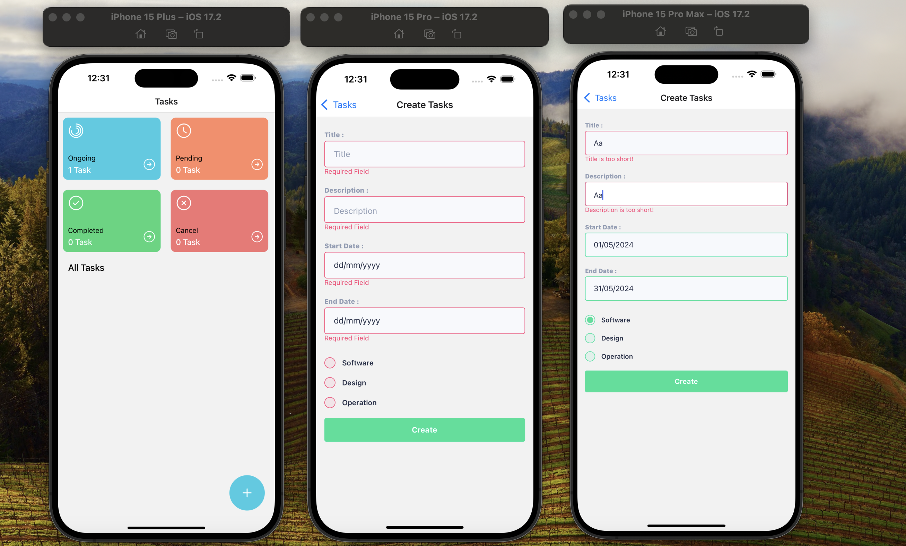
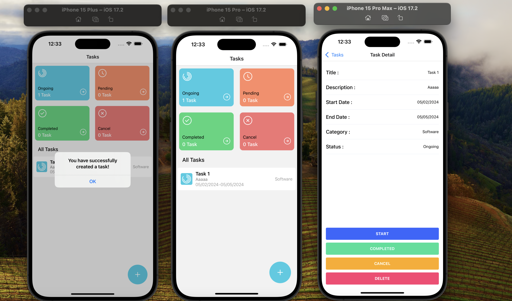
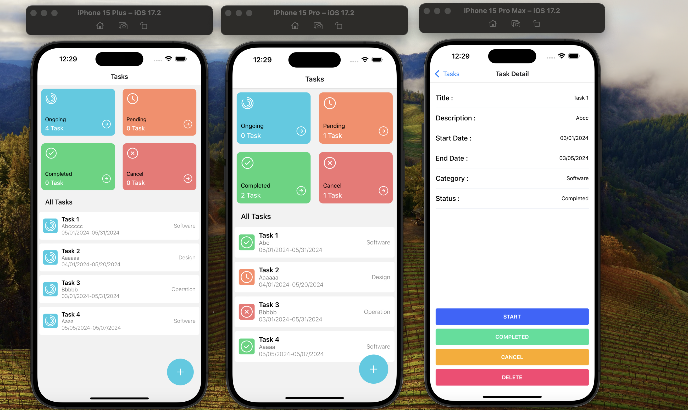

# Task Manager App

This is a React Native application designed for task management. The tasks begin with an "ongoing" status, and when you navigate to the detail page, you can perform actions such as canceling, completing, deleting, or starting a task. The tasks are updated dynamically as changes occur.

# Features

- Task Management: Add, view, and delete tasks.
- Task Status: Tasks start with an "ongoing" status and can be updated to "completed," "canceled," "pending," or "deleted."
- Validation: Task addition is implemented using Formik and Yup for validation.
- Dynamic Updates: Any changes to tasks are reflected immediately on the main task list.

# SCREEN GIF


# SCREEN VIEW








# Usage

- Task Management: Upon launching the application, you will be directed to the main task list where tasks begin with an "ongoing" status.
- Task Details: Tap on any task to view its details. From the detail page, you can perform various actions such as:
  - Cancel: Mark the task as canceled.
  - Complete: Mark the task as completed.
  - Delete: Permanently remove the task.
  - Start: Initiate the task.
- Dynamic Updates: Any changes made to tasks, such as status updates, are instantly reflected on the main task list on the homepage.
- Adding Tasks: To add a new task:
  - Navigate to the "Add Task" section.
  - Fill out the form with the required information.
  - Validation using Formik and Yup ensures that all necessary fields are filled correctly.
- Navigation: The application utilizes React Navigation for seamless navigation between different screens.
- Data Persistence: Task data is stored locally using AsyncStorage, ensuring that tasks are retained even after the application is closed.
- Icons: Icons for various actions and elements within the application are implemented using the Icon-Sax library.

# Libraries Used

```
# Moment
-Moment is a JavaScript library for parsing, validating, manipulating, and formatting dates.
-It provides an easy-to-use API for working with dates and times in various formats.Moment is widely used in web development, especially when dealing with date and time-related operations.

# UUID
-UUID (Universally Unique Identifier) is a standardized format for generating unique identifiers.
-UUIDs are used to uniquely identify entities in distributed systems where a centralized authority may not be available to assign unique identifiers.
-They are commonly used in various scenarios such as database records, session IDs, messaging, and more.

# React Navigation:
- React Navigation is a widely-used library for managing navigation and routing in React Native apps.
- It offers various navigation components like Stack, Tab, and Drawer Navigator for building navigation flows.
- React Navigation is highly customizable and supports both iOS and Android platforms.

# Iconsax-react-native:
- Iconsax-react-native is a library providing a collection of high-quality icons for React Native apps.
- It simplifies the integration of icons into apps by offering a convenient way to use Iconsax icons as React Native components.
- Iconsax offers a diverse range of icons covering different categories.

# React Native AsyncStorage:
- AsyncStorage is an API for storing key-value pairs asynchronously in React Native apps.
- It's commonly used for persisting small amounts of data locally on the device, such as user preferences and settings.
- AsyncStorage operates asynchronously, ensuring smooth app performance, but it's best suited for storing small data sets.
# Formik:
- Formik is a popular form library for React that helps in managing forms with ease. It simplifies form validation, handling form submission, and managing form state. Formik integrates seamlessly with React and supports Yup for form validation.
# Yup:
- Yup is a JavaScript schema builder for value parsing and validation. It's commonly used with Formik to define validation rules for form fields. Yup allows you to define schemas to validate the shape and content of your data.
# React Native UI Kitten:
- React Native UI Kitten is a mobile framework for building stunning cross-platform applications. It provides a set of customizable UI components for React Native applications, which follow the Material Design guidelines. UI Kitten components are highly customizable and offer a consistent look and feel across different platforms.

```
